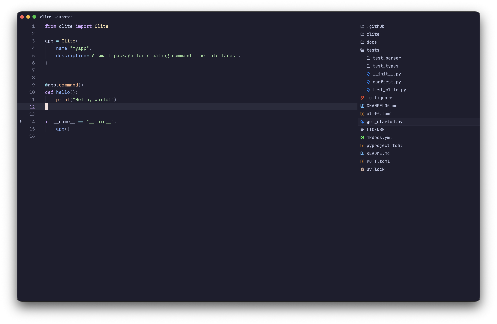

# Zed Minimal Setup

This is a minimal setup for Zed.

## Installation

Required dependencies:

Font Family:

- [JetBrainsMono Nerd Font](https://github.com/ryanoasis/nerd-fonts/tree/master/patched-fonts/JetBrainsMono)

Extensions:

This is a list of extensions(url + extension id) that I use.

- [Catppuccin Theme](https://github.com/catppuccin/zed) - catppuccin
- [Colored Zed Icons Theme](https://github.com/TheRedXD/zed-icons-colored-theme) - colored-zed-icons-theme

## Usage

- Please backup your `settings.json` file
- Open Zed
- Press `Ctrl + ,` / `Command + ,`  to open settings
- Copy the `settings.json` file
- Press `Ctrl + P` / `Command + P`  to open command palette
- Search for `settings profile selector: toggle`
- Choose `Zed Minimal Setup`

## License

This project is licensed under the terms of the MIT license.
